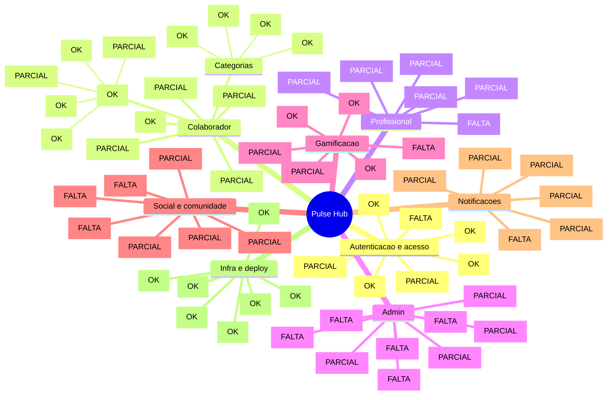

# Pulse Hub - mapa mental do produto

Documento para revisao funcional com parceiro.

Objetivo:
- listar tudo que ja existe no produto
- separar o que esta parcial ou mockado
- apontar o que ainda falta decidir ou implementar
- evitar que paginas, sessoes e fluxos importantes fiquem de fora

## Atualizacao de execucao (2026-04-17)

- Checklist tecnico oficial para implementar e fechar funcionalidades por papel:
  - `docs/checklist-funcionalidades-e-inclusoes.md`
- Regra de acesso fechada:
  - USER acessa somente `/usuario/*`
  - PROFESSIONAL acessa somente `/profissional/*`
  - ADMIN acessa somente `/admin/*`

Legenda:
- `[OK]` implementado na interface ou na estrutura tecnica
- `[PARCIAL]` existe na UI ou no fluxo, mas ainda depende de backend, regra ou CRUD real
- `[FALTA]` ainda nao existe no produto atual

## Mapa mental

## Inventario de paginas e sessoes

### 1. Entrada / autenticacao

- `/` - landing com login e onboarding `[OK]`
- login por papel: colaborador, profissional e admin `[OK]`
- onboarding com objetivo e frequencia `[PARCIAL]`
- CTA Google Workspace `[PARCIAL]`
- link "esqueci minha senha" `[FALTA]`

### 2. Colaborador

- `/usuario` - Home `[OK]`
  - saudacao e navegacao `[OK]`
  - cards principais: saude e bem-estar, cultura, eventos, festas `[OK]`
  - card de proxima sessao `[OK]`
  - card de pontos e ofensiva `[OK]`
  - metas da semana `[OK]`
  - ranking rapido `[OK]`
  - proximos eventos `[OK]`
  - feed social da equipe `[PARCIAL]`
  - depoimentos `[PARCIAL]`

- `/usuario/agenda` - Agenda `[PARCIAL]`
  - calendario visual `[OK]`
  - filtros por especialidade `[OK]`
  - horarios disponiveis/ocupados/lista de espera `[OK]`
  - confirmar agendamento real `[FALTA]`
  - validacao de vagas no backend `[FALTA]`

- `/usuario/ranking` - Ranking `[OK]`
  - ranking geral `[OK]`
  - destaque da posicao do usuario `[OK]`
  - categorias de ranking `[PARCIAL]`

- `/usuario/progresso` - Progresso `[PARCIAL]`
  - frequencia semanal `[OK]`
  - evolucao de metas `[OK]`
  - input de peso `[OK]`
  - input de humor `[OK]`
  - input de habitos `[OK]`
  - persistencia real do historico `[FALTA]`

- `/usuario/acompanhamento` - Acompanhamento `[PARCIAL]`
  - plano alimentar em cards `[OK]`
  - recomendacoes do profissional `[OK]`
  - upload de feedback (placeholder) `[PARCIAL]`
  - check diario `[OK]`
  - upload real de arquivo `[FALTA]`

- `/usuario/perfil` - Perfil `[PARCIAL]`
  - resumo do usuario `[OK]`
  - preferencias de notificacao `[OK]`
  - mensagens recentes `[OK]`
  - sessao tecnica / estrutura pronta `[OK]`
  - salvar preferencias no backend `[FALTA]`

### 3. Categorias dedicadas

- `/usuario/saude-bem-estar` `[OK]`
  - nutricionista com Vitoria `[OK]`
  - fisioterapeuta com Mirna `[OK]`
  - terapia com Gabriel `[OK]`
  - terapia com Giovanna `[OK]`
  - enfermagem com Camila `[OK]`
  - recreacao infantil `[OK]`
  - defesa pessoal com Felipe `[OK]`

- `/usuario/cultura` `[OK]`
  - campanhas internas `[OK]`
  - mensagem da lideranca `[OK]`
  - onboarding cultural `[OK]`

- `/usuario/eventos` `[OK]`
  - eventos corporativos `[OK]`
  - presenca e check-in visual `[PARCIAL]`

- `/usuario/festas` `[OK]`
  - happy hour `[OK]`
  - celebracoes `[OK]`
  - RSVP visual `[PARCIAL]`

### 4. Profissional

- `/profissional` - Painel do profissional `[PARCIAL]`
  - atendimentos do dia `[OK]`
  - taxa de comparecimento `[OK]`
  - pacientes ativos `[OK]`
  - observacoes pendentes `[OK]`
  - agenda do dia `[OK]`
  - confirmar presenca `[PARCIAL]`
  - ver historico `[PARCIAL]`
  - observacoes clinicas `[PARCIAL]`
  - metricas com grafico `[PARCIAL]`
  - publicar fotos/atividades no feed `[FALTA]`

### 5. Admin

- `/admin` - Painel administrativo `[PARCIAL]`
  - usuarios ativos `[OK]`
  - engajamento mensal `[OK]`
  - sessoes realizadas `[OK]`
  - avaliacao geral `[OK]`
  - grafico de retencao `[PARCIAL]`
  - acoes rapidas `[PARCIAL]`
  - notificacoes em massa `[PARCIAL]`
  - CRUD de usuarios `[FALTA]`
  - CRUD de profissionais `[FALTA]`
  - CRUD de eventos/cultura/lazer/festas `[FALTA]`
  - regras de pontuacao `[FALTA]`
  - limites de agenda `[FALTA]`
  - relatorios filtrados `[FALTA]`

## Funcionalidades transversais

### Autenticacao e seguranca

- API de login `[OK]`
- API de cadastro `[OK]`
- health check `[OK]`
- JWT com `jose` `[OK]`
- cookie de sessao `[OK]`
- middleware/proxy para RBAC `[OK]`
- modo demo `[OK]`
- login social real `[FALTA]`
- recuperacao de senha `[FALTA]`
- refresh token / expiracao refinada `[FALTA]`

### Gamificacao

- pontuacao exibida na Home `[OK]`
- ranking geral `[OK]`
- streak/ofensiva `[OK]`
- pontos em categorias e atividades `[PARCIAL]`
- calculo real baseado em sessoes/eventos `[FALTA]`
- regras editaveis pelo admin `[FALTA]`

### Social / comunidade

- feed na Home `[PARCIAL]`
- curtidas em estado local `[PARCIAL]`
- comentarios em estado local `[PARCIAL]`
- bloco de depoimentos `[PARCIAL]`
- postagem real pelo profissional `[FALTA]`
- upload de imagem real `[FALTA]`
- moderacao/aprovacao `[FALTA]`
- politica de uso de imagem `[FALTA]`
- pagina dedicada de feed `[FALTA]`

### Agenda e atendimento

- visualizacao de slots `[OK]`
- filtros por tipo `[OK]`
- estado de disponivel/ocupado/lista de espera `[OK]`
- reserva real em banco `[FALTA]`
- bloqueio de conflitos `[FALTA]`
- regramento de fila de espera `[FALTA]`
- integracao com calendario externo `[FALTA]`

### Notificacoes

- preferencias visuais no perfil `[OK]`
- mensagens internas mockadas `[OK]`
- lembretes e vaga liberada como conceito `[PARCIAL]`
- disparo real automatizado `[FALTA]`
- push web/app `[FALTA]`

### Progresso e acompanhamento

- charts e visuais `[OK]`
- inputs de peso/humor/habitos `[OK]`
- plano alimentar e recomendacoes `[OK]`
- upload de feedback `[PARCIAL]`
- persistencia historica real `[FALTA]`

### PWA / experiencia mobile

- manifest `[OK]`
- icones `[OK]`
- estrutura mobile-first `[OK]`
- prompt de instalacao `[OK]`
- experiencia offline `[FALTA]`
- push nativo `[FALTA]`

### Infra / banco / deploy

- Next.js App Router `[OK]`
- Prisma schema `[OK]`
- Neon ready `[OK]`
- Vercel ready `[OK]`
- estrutura de componentes `[OK]`
- models atuais no schema:
  - `User`
  - `ProfessionalProfile`
  - `SessionBooking`
  - `Event`
  - `EventAttendance`
  - `WellnessEntry`
  - `Notification`
- models que ainda faltam para fechar o produto:
  - `FeedPost`
  - `FeedComment`
  - `FeedLike`
  - `Testimonial`
  - `MediaAsset`
  - `NotificationPreference`
  - possivelmente `Company`, `Department`, `Challenge`, `ScoringRule`

## O que esta forte hoje

- base visual consistente e SaaS/mobile-first
- paginas principais ja desenhadas
- separacao por papel de usuario
- categorias dedicadas com rota propria
- feed social e depoimentos ja prototipados
- stack pronta para GitHub, Vercel e Neon

## O que ainda precisa de definicao do parceiro

### 1. Escopo do feed social

- quem pode postar: apenas profissional ou admin tambem?
- colaborador pode postar ou apenas interagir?
- o post precisa de aprovacao antes de aparecer?
- pode marcar colaboradores nas fotos?
- vai existir denuncia/report de conteudo?

### 2. Politica de imagem

- pode usar foto real dos colaboradores?
- precisa aceite de uso de imagem?
- algumas atividades nao podem ser fotografadas?

### 3. Depoimentos

- depoimento e publico para toda empresa ou apenas admins/profissionais?
- precisa aprovacao antes de publicar?
- sera por profissional, por atividade ou ambos?
- tera nota de 1 a 5?

### 4. Agenda

- o slot e fixo ou gerado dinamicamente?
- a fila de espera e automatica?
- pode remarcar/cancelar no app?
- cada profissional tem agenda propria?
- precisa integrar Google Calendar ou Outlook?

### 5. Gamificacao

- quanto vale cada sessao, evento e check-in?
- like/comentario no feed gera pontos?
- depoimento gera pontos?
- admin pode editar regra sem deploy?

### 6. Profissional

- precisa tela dedicada para criar post?
- precisa historico completo por paciente?
- precisa anexar documentos/planos?
- precisa ver comentarios/depoimentos sobre si?

### 7. Admin

- precisa CRUD completo ou painel com acoes rapidas basta?
- precisa relatorios exportaveis?
- precisa filtros por empresa, area, profissional e periodo?
- precisa gerir regras de notificacao e pontuacao?

## Sugestao de backlog por prioridade

### Prioridade 1 - fechar produto minimo

- booking real com Prisma
- CRUD real de eventos
- salvar progresso e acompanhamento
- login/cadastro persistidos no banco
- painel profissional salvando observacoes

### Prioridade 2 - fechar engajamento

- feed real com upload de imagem
- curtidas e comentarios persistidos
- depoimentos persistidos e moderados
- notificacoes reais
- regras reais de pontuacao

### Prioridade 3 - fechar operacao

- admin com CRUD completo
- relatorios reais
- filtros por area/profissional/periodo
- integracoes calendario/push/storage

## Resposta esperada do parceiro

Peça para ele devolver o documento com:

- itens para adicionar
- itens para remover
- itens para renomear
- prioridades por fase
- regras de negocio que faltam
- telas novas necessarias
- quais partes podem continuar mockadas e quais precisam virar backend agora

## Sugestao de uso

Fluxo ideal:

1. voce envia este documento
2. ele marca cada bloco com observacoes
3. voces fecham prioridade 1, 2 e 3
4. eu transformo isso em backlog tecnico e plano de implementacao
