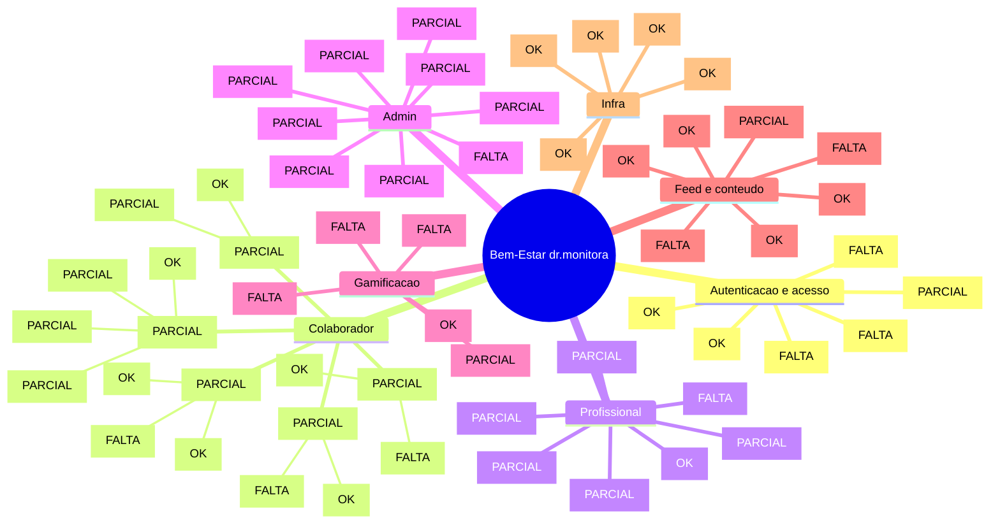

# dr.monitora Bem-Estar - mapa mental do produto

Data da revisao: 2026-05-11
Documento principal de backlog: `docs/checklist-funcionalidades-e-inclusoes.md`

Objetivo:

- dar uma visao executiva do produto atual;
- refletir o codigo existente, sem decisoes antigas defasadas;
- separar produto em modulos menores para evoluir sem quebrar a plataforma hospedada;
- apoiar a aprovacao de escopo antes de mexer em banco, API ou tela.

## Legenda

- `[OK]` existe e esta ligado em fluxo basico.
- `[PARCIAL]` existe, mas depende de regra, acabamento, tela, API ou integracao.
- `[FALTA]` ainda nao existe de forma funcional.
- `[DECISAO]` precisa de definicao de produto/compliance antes de implementar.

## Mapa mental

## Inventario resumido

### Entrada e autenticacao

- `/` - landing/login/onboarding. `[OK]`
- `/api/auth/login`, `/api/auth/register`, `/api/auth/logout`. `[OK]`
- JWT + cookie `pulsehub.session`. `[OK]`
- RBAC por `src/proxy.ts`. `[OK]`
- Cadastro pendente/aprovacao. `[FALTA]`
- Recuperacao de senha. `[FALTA]`
- Termo obrigatorio no primeiro login. `[FALTA]`

### Usuario

- `/usuario` - home. `[PARCIAL]`
- `/usuario/agenda` - agenda com slots, reserva e lista de espera. `[PARCIAL]`
- `/usuario/agenda-dr` - agenda dr/eventos especiais. `[PARCIAL]`
- `/usuario/progresso` - registros de bem-estar. `[PARCIAL]`
- `/usuario/ranking` - ranking por score. `[PARCIAL]`
- `/usuario/perfil` - perfil e registros profissionais. `[PARCIAL]`
- `/usuario/acompanhamento` - acompanhamento e feedback. `[PARCIAL]`
- `/usuario/configuracoes` - avatar, senha e preferencias. `[PARCIAL]`
- Categorias dedicadas: saude e bem-estar, cultura, eventos, festas. `[PARCIAL]`

### Profissional

- `/profissional` - dashboard. `[PARCIAL]`
- `/profissional/agenda` - agenda/atendimentos. `[PARCIAL]`
- `/profissional/registros` - registros. `[PARCIAL]`
- `/profissional/feed` e `/profissional/feed/novo`. `[PARCIAL]`
- `/profissional/pacientes/[id]` - historico do paciente. `[PARCIAL]`

### Admin

- `/admin` - dashboard. `[PARCIAL]`
- `/admin/usuarios` - gestao de usuarios. `[PARCIAL]`
- `/admin/profissionais` - gestao de profissionais. `[PARCIAL]`
- `/admin/eventos` - gestao de eventos. `[PARCIAL]`
- `/admin/gamificacao` - regras de pontuacao. `[PARCIAL]`
- `/admin/moderacao` - moderacao/chave de postagem. `[PARCIAL]`
- `/admin/notificacoes` - notificacoes. `[PARCIAL]`
- `/admin/relatorios` - relatorios. `[FALTA]`
- `/admin/compliance` - compliance. `[PARCIAL]`
- `/admin/conteudos` - conteudos/cards. `[PARCIAL]`

## Modulos de evolucao

### 0. Diagnostico e backlog tecnico

Status: `[OK]`

- Atualizar checklist real.
- Separar implementado/parcial/falta regra/falta banco/falta API/falta tela.
- Definir ordem segura de commits.

### 1. Usuarios, aprovacao e grupos

Status: `[FALTA]`

- Cadastro pendente/aprovacao.
- Grupos/tags/turmas.
- Restricao por convite ou aprovacao manual.

### 2. Compliance e aceites

Status: `[FALTA]`

- Termo no primeiro login.
- Aceite de imagem/publicacao.
- Texto juridico de liberalidade e nao substituicao medica.

### 3. Gamificacao

Status: `[PARCIAL]`

- Separar pontos de moedas.
- Criar saldo/ledger.
- Regras de login, check-in, streak, eventos e campanhas.

### 4. Ranking e privacidade

Status: `[PARCIAL]`

- Flag para aparecer ou nao no ranking.
- Nome anonimo/censurado.
- Top 3/top 10 ou posicao individual.

### 5. Check-in e progresso

Status: `[PARCIAL]`

- Check-in diario com trava.
- Streak de 5 dias.
- Medidas admin de humor, energia e cansaco por quantidade de pessoas.

### 6. Turmas, eventos fechados e presenca

Status: `[PARCIAL]`

- Turma da Maisa, clube do livro e ingles.
- Participantes selecionados.
- Presenca/check-in por aula/evento.

### 7. Feed e moderacao

Status: `[PARCIAL]`

- Decidir pre-moderacao, pos-moderacao ou campanha.
- Fila de aprovacao.
- Regra de quem pode postar.

### 8. Conteudos/blog

Status: `[FALTA]`

- Dicas/artigos/publicacoes dos especialistas.
- Admin publica em nome da equipe.
- Links, imagem, observacoes e descricao.

### 9. Perfil dos profissionais

Status: `[PARCIAL]`

- Tags/categorias por profissional.
- Campos especificos por area.
- Avaliacao por estrelas/nota/sentimento.

### 10. Links, embeds e materiais

Status: `[PARCIAL]`

- Link externo.
- Embed/iframe controlado.
- Caso Camila.

### 11. Painel admin

Status: `[PARCIAL]`

- Indicadores de engajamento, humor, pontuacao, avaliacoes e profissionais.
- Alertas de baixa frequencia ou situacao critica.
- Relatorios filtrados/exportaveis.

### 12. Painel profissional

Status: `[PARCIAL]`

- Agenda, historico, registros e observacoes.
- Comunicacao interna por notas/mural.
- Metricas de presenca e atendimentos.

### 13. Notificacoes

Status: `[PARCIAL]`

- Priorizar in-app.
- Aviso de vaga, turma, campanha, check-in e evento.
- Push real fica para etapa posterior.

## Decisoes pendentes mais importantes

- Cadastro publico continua aberto ou vira solicitacao pendente?
- Quais grupos/turmas entram primeiro: ingles, Maisa, clube do livro?
- Ranking mostra top completo, top parcial ou apenas posicao do usuario?
- Usuario anonimo aparece como `Usuario #23`, `*****` ou sai da lista publica?
- Feed usa pre-moderacao, pos-moderacao ou abre apenas por campanha?
- Profissional pode publicar direto ou apenas sugerir conteudo para admin?
- Check-in vale por dia calendario ou janela de 24 horas?
- Falta em aula/evento perde pontos/moedas ou apenas deixa de ganhar?
- Dados emocionais criticos aparecem para admin, RH, lideranca ou profissional?

## Regra operacional para proximas entregas

Cada modulo funcional deve seguir:

1. branch pequena;
2. alteracao aditiva no banco quando necessario;
3. tela/API protegida por papel;
4. `npm run lint`;
5. `npm run build`;
6. commit unico do modulo;
7. push para GitHub;
8. conferencia de deploy/preview na Vercel.
